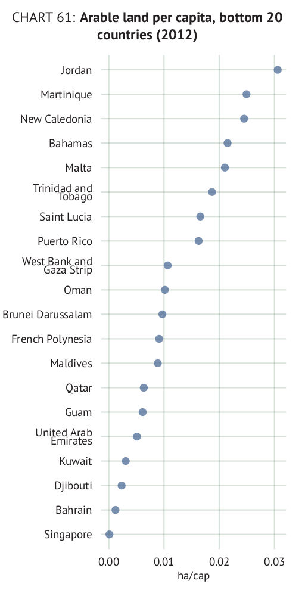
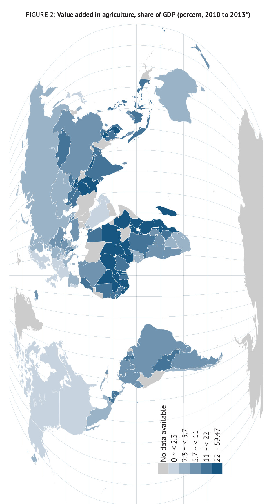

## Chart types

Below you will find an excel template for defining the tables and instructions on how to fill in the spreadsheet. 

|      code     |                                           preview                                            |           notes           |
| ------------- | -------------------------------------------------------------------------------------------- | ------------------------- |
| `lineplot1`   |        | Some notes about the plot |
| `top_dot`     |          | Some notes about the plot |
| `bot_dot`     |          | Some notes about the plot |
| `top_bot_dot` |  | Some notes about the plot |
| `map`         |                  | Some notes about the plot |
| `minitable`   |      | Some notes about the plot |

